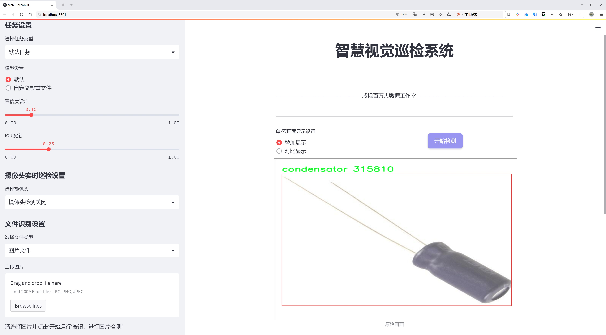
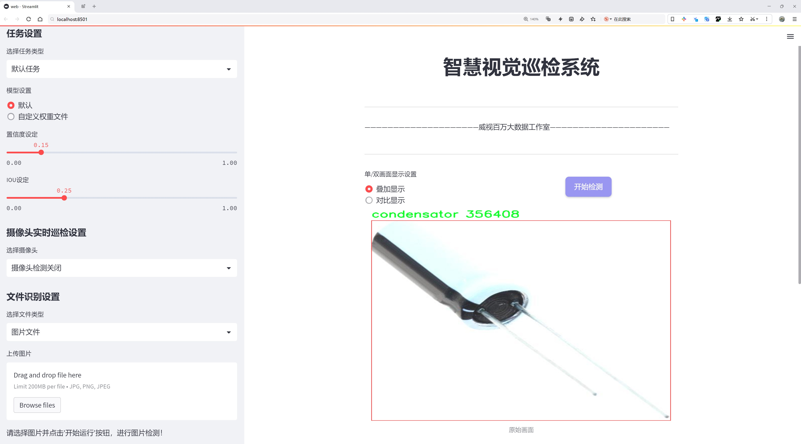
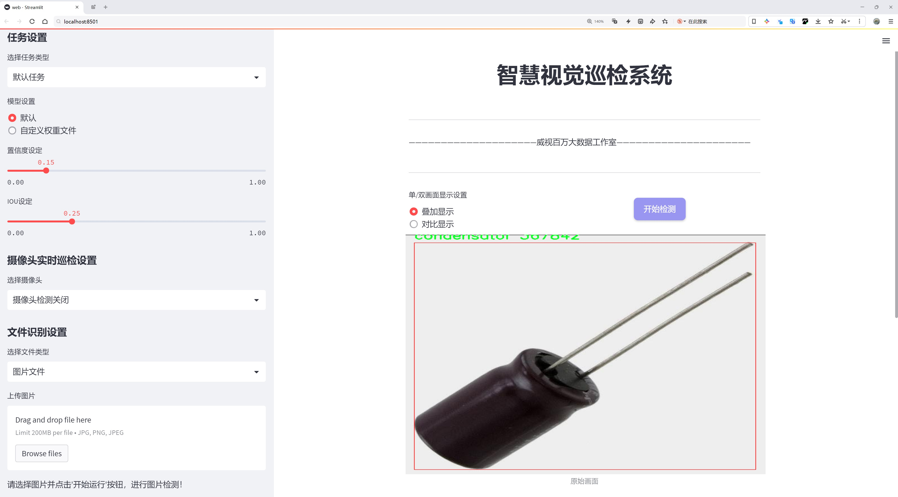
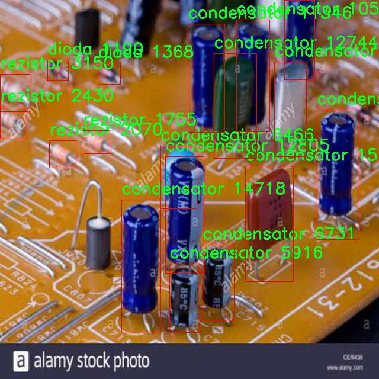
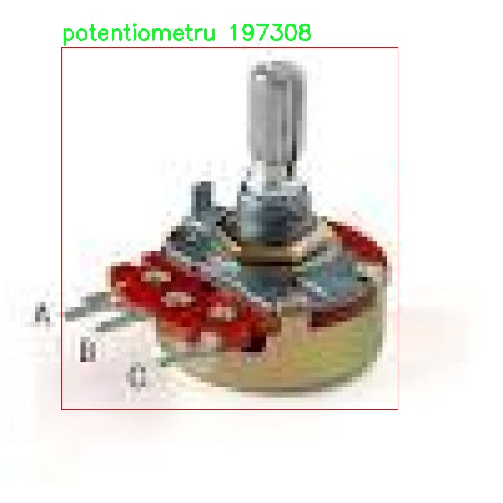
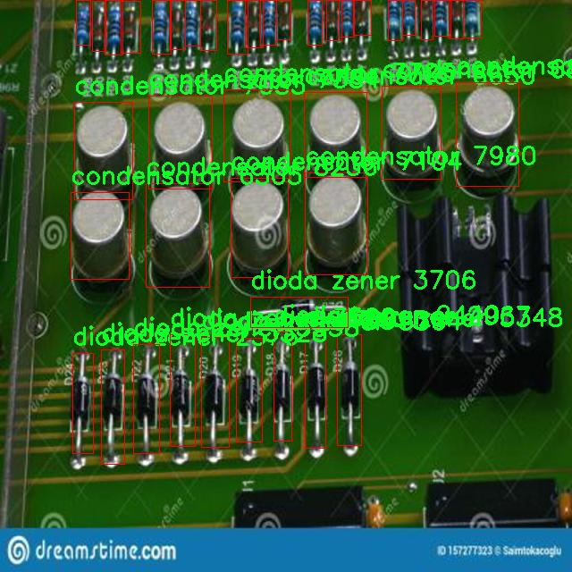
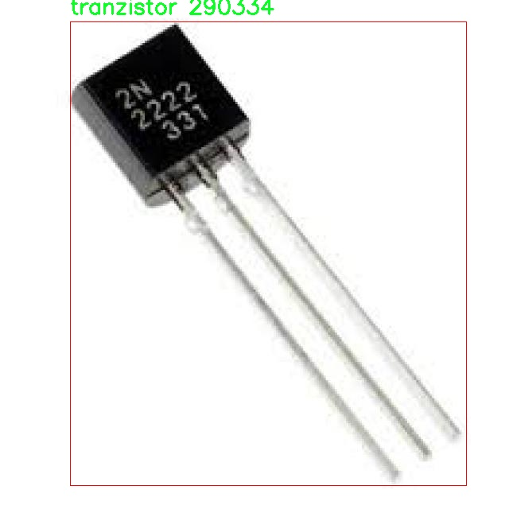
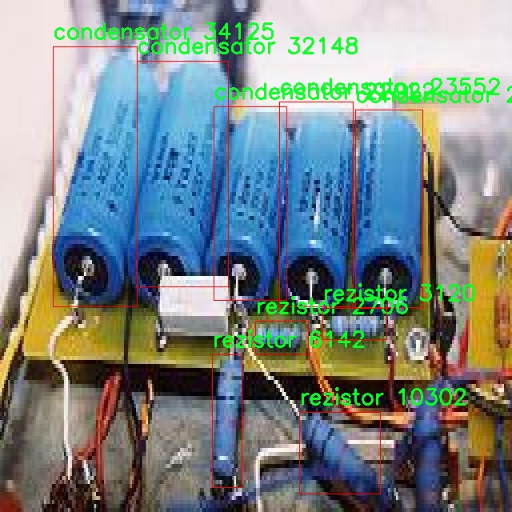

# 电子元件检测2检测系统源码分享
 # [一条龙教学YOLOV8标注好的数据集一键训练_70+全套改进创新点发刊_Web前端展示]

### 1.研究背景与意义

项目参考[AAAI Association for the Advancement of Artificial Intelligence](https://gitee.com/qunshansj/projects)

项目来源[AACV Association for the Advancement of Computer Vision](https://gitee.com/qunmasj/projects)

研究背景与意义

随着电子技术的迅猛发展，电子元件的种类和数量不断增加，尤其是在智能设备、物联网和自动化系统中，电子元件的应用愈发广泛。这些元件的准确检测与识别不仅对生产线的自动化程度提出了更高的要求，也对产品的质量控制和维护管理提出了新的挑战。在这一背景下，计算机视觉技术，尤其是基于深度学习的目标检测算法，逐渐成为电子元件检测领域的重要研究方向。

YOLO（You Only Look Once）系列算法因其高效性和实时性在目标检测任务中得到了广泛应用。YOLOv8作为该系列的最新版本，进一步提升了检测精度和速度，适应了复杂环境下的目标检测需求。然而，针对特定领域如电子元件检测，YOLOv8的标准模型可能无法充分发挥其优势。因此，基于改进YOLOv8的电子元件检测系统的研究具有重要的理论价值和实际意义。

本研究所使用的数据集包含3300张图像，涵盖了13类电子元件，包括电池（baterie）、电感（bobina）、按钮（buton）、蜂鸣器（buzzer）、电容器（condensator）、二极管（dioda）、齐纳二极管（dioda zener）、光电二极管（fotodioda）、集成电路（ic）、发光二极管（led）、电位器（potentiometru）、电阻器（rezistor）和晶体管（tranzistor）。这些类别的选择反映了现代电子设备中常见的元件类型，具有较强的代表性和实用性。通过对这些元件的检测与识别，能够有效提升电子产品的组装效率和质量控制水平。

在研究过程中，我们将对YOLOv8进行改进，以适应电子元件的检测需求。这包括但不限于优化网络结构、调整超参数、增强数据集等。通过这些改进，期望在提高检测精度的同时，保持较高的检测速度，从而实现实时检测的目标。此外，研究还将探讨如何利用迁移学习和数据增强技术，进一步提升模型在小样本数据集上的表现，以应对实际应用中可能遇到的样本不足问题。

该研究的意义不仅在于提升电子元件的检测技术水平，更在于为智能制造和自动化生产提供有力的技术支持。随着智能化生产的推进，电子元件的检测将越来越依赖于自动化系统，而基于改进YOLOv8的检测系统正是实现这一目标的重要手段。通过实现高效、准确的电子元件检测，能够有效降低人工成本，提高生产效率，推动电子行业的智能化转型。

综上所述，基于改进YOLOv8的电子元件检测系统的研究，不仅具有重要的学术价值，也对实际生产具有深远的影响。随着研究的深入，期望能够为电子元件的智能检测提供新的思路和方法，推动相关领域的进一步发展。

### 2.图片演示







##### 注意：由于此博客编辑较早，上面“2.图片演示”和“3.视频演示”展示的系统图片或者视频可能为老版本，新版本在老版本的基础上升级如下：（实际效果以升级的新版本为准）

  （1）适配了YOLOV8的“目标检测”模型和“实例分割”模型，通过加载相应的权重（.pt）文件即可自适应加载模型。

  （2）支持“图片识别”、“视频识别”、“摄像头实时识别”三种识别模式。

  （3）支持“图片识别”、“视频识别”、“摄像头实时识别”三种识别结果保存导出，解决手动导出（容易卡顿出现爆内存）存在的问题，识别完自动保存结果并导出到tempDir中。

  （4）支持Web前端系统中的标题、背景图等自定义修改，后面提供修改教程。

  另外本项目提供训练的数据集和训练教程,暂不提供权重文件（best.pt）,需要您按照教程进行训练后实现图片演示和Web前端界面演示的效果。

### 3.视频演示

[3.1 视频演示](https://www.bilibili.com/video/BV1qE4beqEU7/)

### 4.数据集信息展示

##### 4.1 本项目数据集详细数据（类别数＆类别名）

nc: 13
names: ['baterie', 'bobina', 'buton', 'buzzer', 'condensator', 'dioda zener', 'dioda', 'fotodioda', 'ic', 'led', 'potentiometru', 'rezistor', 'tranzistor']


##### 4.2 本项目数据集信息介绍

数据集信息展示

在本研究中，我们采用了名为“cond”的数据集，以支持对电子元件检测系统的改进，特别是针对YOLOv8模型的训练。该数据集专注于电子元件的识别与分类，涵盖了13个不同的类别，旨在提升模型在实际应用中的准确性和鲁棒性。数据集的类别包括：电池（baterie）、线圈（bobina）、按钮（buton）、蜂鸣器（buzzer）、电容器（condensator）、齐纳二极管（dioda zener）、普通二极管（dioda）、光电二极管（fotodioda）、集成电路（ic）、发光二极管（led）、电位器（potentiometru）、电阻器（rezistor）以及晶体管（tranzistor）。这些类别涵盖了电子元件的广泛应用，适用于多种电子设备和电路的设计与分析。

数据集“cond”的构建过程经过精心设计，确保了每个类别的样本数量和质量，以便为YOLOv8模型提供足够的训练数据。每个类别的样本均经过标注，确保在训练过程中模型能够准确识别和分类不同的电子元件。这些样本不仅包括静态图像，还可能涵盖不同角度、光照条件和背景的变化，以增强模型的泛化能力。通过多样化的样本，模型能够在面对实际应用中复杂的环境时，依然保持高效的识别能力。

在电子元件检测的实际应用中，准确性和实时性是至关重要的。通过使用“cond”数据集，我们希望能够训练出一个在多种场景下都能表现出色的YOLOv8模型。该模型不仅需要能够识别每种电子元件的存在，还需能够在图像中精确定位这些元件的位置。为此，数据集中的每个样本都附带了详细的标注信息，包括元件的边界框坐标和类别标签。这些信息将直接用于模型的训练过程，使其能够学习到如何在图像中快速而准确地识别和定位不同的电子元件。

此外，数据集的多样性和丰富性为模型的训练提供了良好的基础。通过引入不同的背景、光照和拍摄角度，模型将能够学习到更为复杂的特征，从而提升其在真实场景中的应用能力。这种训练策略不仅提高了模型的准确性，还增强了其在面对未知数据时的适应性。

总之，数据集“cond”在电子元件检测领域的应用为YOLOv8模型的改进提供了坚实的基础。通过对13个类别的全面覆盖和高质量的样本标注，我们期望在未来的研究中，能够实现更高效、更准确的电子元件检测系统。这将为电子产品的设计、制造和维护提供重要的技术支持，推动电子行业的进一步发展。











### 5.全套项目环境部署视频教程（零基础手把手教学）

[5.1 环境部署教程链接（零基础手把手教学）](https://www.ixigua.com/7404473917358506534?logTag=c807d0cbc21c0ef59de5)


[5.2 安装Python虚拟环境创建和依赖库安装视频教程链接（零基础手把手教学）](https://www.ixigua.com/7404474678003106304?logTag=1f1041108cd1f708b01a)

### 6.手把手YOLOV8训练视频教程（零基础小白有手就能学会）

[6.1 手把手YOLOV8训练视频教程（零基础小白有手就能学会）](https://www.ixigua.com/7404477157818401292?logTag=d31a2dfd1983c9668658)

### 7.70+种全套YOLOV8创新点代码加载调参视频教程（一键加载写好的改进模型的配置文件）

[7.1 70+种全套YOLOV8创新点代码加载调参视频教程（一键加载写好的改进模型的配置文件）](https://www.ixigua.com/7404478314661806627?logTag=29066f8288e3f4eea3a4)

### 8.70+种全套YOLOV8创新点原理讲解（非科班也可以轻松写刊发刊，V10版本正在科研待更新）

由于篇幅限制，每个创新点的具体原理讲解就不一一展开，具体见下列网址中的创新点对应子项目的技术原理博客网址【Blog】：


[8.1 70+种全套YOLOV8创新点原理讲解链接](https://gitee.com/qunmasj/good)

### 9.系统功能展示（检测对象为举例，实际内容以本项目数据集为准）

图9.1.系统支持检测结果表格显示

  图9.2.系统支持置信度和IOU阈值手动调节

  图9.3.系统支持自定义加载权重文件best.pt(需要你通过步骤5中训练获得)

  图9.4.系统支持摄像头实时识别

  图9.5.系统支持图片识别

  图9.6.系统支持视频识别

  图9.7.系统支持识别结果文件自动保存

  图9.8.系统支持Excel导出检测结果数据


### 10.原始YOLOV8算法原理

原始YOLOv8算法原理

YOLOv8算法作为YOLO系列的最新版本，代表了计算机视觉领域中目标检测技术的前沿。它不仅在精度和速度上超越了前代模型，还在架构设计和功能实现上进行了深度的创新与优化。YOLOv8的设计理念源于对YOLOv5、YOLOv6和YOLOX等前期模型的深入分析与学习，旨在通过结合这些模型的优点，创造出一个更加高效、灵活且易于使用的目标检测框架。

YOLOv8的网络结构主要由四个核心部分组成：输入层、Backbone骨干网络、Neck特征融合网络和Head检测模块。输入层负责对输入图像进行预处理，包括图像比例调整、Mosaic增强以及瞄点计算等操作。这些步骤确保了输入数据的多样性和丰富性，从而为后续的特征提取打下良好的基础。

在Backbone部分，YOLOv8采用了新的C2f模块来替代传统的C3模块。这一变化不仅提升了特征提取的效率，还增强了梯度流动的信息量。C2f模块通过引入更多的跳层连接和Split操作，使得网络能够更好地捕捉不同尺度的特征，进而提高对小目标的检测能力。值得注意的是，YOLOv8在Backbone中的C2f块数进行了优化，从原来的3-6-9-3调整为3-6-6-3，这一改动使得网络在保持轻量级特性的同时，能够提取到更丰富的特征信息。

Neck部分则继续采用“双塔结构”，结合了特征金字塔和路径聚合网络的优势。这种设计促进了语义特征与定位特征之间的有效转移，使得网络在处理复杂场景时，能够更好地融合不同层次的特征信息。这一特征融合的能力极大地增强了YOLOv8在不同尺度目标检测中的表现，尤其是在复杂背景下的小目标检测任务中。

在Head检测模块中，YOLOv8引入了新的解耦头结构，显著提高了模型的收敛速度。与传统的耦合头不同，解耦头将分类和回归任务分开处理，减少了相互之间的干扰，从而使得模型在进行目标检测时更加高效。此外，YOLOv8采用了Anchor-Free的检测策略，取消了之前的objectness分支，简化了模型的结构。这一创新使得YOLOv8在多种硬件平台上都能高效运行，无论是CPU还是GPU，均能实现优异的性能。

YOLOv8的另一个显著特点是其新的损失函数设计。通过优化损失函数，YOLOv8能够更好地处理不同类型的目标，提高了检测的准确性和鲁棒性。这一损失函数不仅考虑了目标的定位精度，还关注了分类的准确性，从而在多任务学习中实现了更好的平衡。

此外，YOLOv8在模型的可扩展性和易用性方面也进行了优化。通过对模型结构的精简和模块化设计，用户可以根据具体需求快速调整模型的规模和复杂度。这种灵活性使得YOLOv8能够广泛应用于各种实际场景中，从智能监控到自动驾驶，无不体现出其强大的适应能力。

在训练过程中，YOLOv8充分利用了数据增强技术，通过Mosaic增强等手段提升了模型的泛化能力。这种数据增强策略不仅丰富了训练样本的多样性，还提高了模型对不同环境和条件下目标的识别能力。

总的来说，YOLOv8算法的原理在于通过创新的网络结构设计、灵活的模块组合以及高效的训练策略，达成了在目标检测任务中精度与速度的最佳平衡。它不仅继承了YOLO系列的优良传统，更在此基础上进行了深度的优化与改进，使得YOLOv8成为当前计算机视觉领域中最为先进的目标检测模型之一。随着YOLOv8的广泛应用，未来的目标检测技术将更加智能化和高效化，为各行各业带来更多的可能性与机遇。


### 11.项目核心源码讲解（再也不用担心看不懂代码逻辑）

#### 11.1 code\ultralytics\utils\callbacks\wb.py

以下是对给定代码的核心部分进行分析和详细注释的结果：

```python
# 导入必要的库和模块
from ultralytics.utils import SETTINGS, TESTS_RUNNING
from ultralytics.utils.torch_utils import model_info_for_loggers

try:
    # 确保当前不是在运行测试
    assert not TESTS_RUNNING  
    # 确保WandB集成已启用
    assert SETTINGS["wandb"] is True  
    import wandb as wb  # 导入WandB库

    # 确保WandB库的版本是有效的
    assert hasattr(wb, "__version__")  

    import numpy as np  # 导入NumPy库
    import pandas as pd  # 导入Pandas库

    _processed_plots = {}  # 用于记录已处理的图表

except (ImportError, AssertionError):
    wb = None  # 如果导入失败或断言失败，则将wb设置为None


def _custom_table(x, y, classes, title="Precision Recall Curve", x_title="Recall", y_title="Precision"):
    """
    创建并记录自定义的精确度-召回率曲线可视化到WandB。

    参数:
        x (List): x轴的值，长度为N。
        y (List): y轴的值，长度为N。
        classes (List): 每个点的类别标签，长度为N。
        title (str, optional): 图表标题，默认为'Precision Recall Curve'。
        x_title (str, optional): x轴标签，默认为'Recall'。
        y_title (str, optional): y轴标签，默认为'Precision'。

    返回:
        (wandb.Object): 适合记录的WandB对象，展示了自定义的可视化指标。
    """
    # 创建一个DataFrame以存储数据
    df = pd.DataFrame({"class": classes, "y": y, "x": x}).round(3)
    fields = {"x": "x", "y": "y", "class": "class"}
    string_fields = {"title": title, "x-axis-title": x_title, "y-axis-title": y_title}
    
    # 使用WandB的plot_table函数记录表格
    return wb.plot_table(
        "wandb/area-under-curve/v0", wb.Table(dataframe=df), fields=fields, string_fields=string_fields
    )


def _plot_curve(
    x,
    y,
    names=None,
    id="precision-recall",
    title="Precision Recall Curve",
    x_title="Recall",
    y_title="Precision",
    num_x=100,
    only_mean=False,
):
    """
    记录一个指标曲线可视化。

    参数:
        x (np.ndarray): x轴的数据点，长度为N。
        y (np.ndarray): y轴的数据点，形状为CxN，其中C表示类别数量。
        names (list, optional): y轴数据对应的类别名称，长度为C。
        id (str, optional): 在WandB中记录数据的唯一标识符，默认为'precision-recall'。
        title (str, optional): 可视化图表的标题，默认为'Precision Recall Curve'。
        x_title (str, optional): x轴的标签，默认为'Recall'。
        y_title (str, optional): y轴的标签，默认为'Precision'。
        num_x (int, optional): 可视化的插值数据点数量，默认为100。
        only_mean (bool, optional): 标志位，指示是否仅绘制均值曲线，默认为True。

    注意:
        该函数利用'_custom_table'函数生成实际的可视化。
    """
    # 创建新的x轴数据
    if names is None:
        names = []
    x_new = np.linspace(x[0], x[-1], num_x).round(5)

    # 创建用于记录的数组
    x_log = x_new.tolist()
    y_log = np.interp(x_new, x, np.mean(y, axis=0)).round(3).tolist()

    if only_mean:
        # 如果只绘制均值曲线
        table = wb.Table(data=list(zip(x_log, y_log)), columns=[x_title, y_title])
        wb.run.log({title: wb.plot.line(table, x_title, y_title, title=title)})
    else:
        # 绘制每个类别的曲线
        classes = ["mean"] * len(x_log)
        for i, yi in enumerate(y):
            x_log.extend(x_new)  # 添加新的x数据
            y_log.extend(np.interp(x_new, x, yi))  # 将y插值到新的x
            classes.extend([names[i]] * len(x_new))  # 添加类别名称
        wb.log({id: _custom_table(x_log, y_log, classes, title, x_title, y_title)}, commit=False)


def on_fit_epoch_end(trainer):
    """在每个训练周期结束时记录训练指标和模型信息。"""
    wb.run.log(trainer.metrics, step=trainer.epoch + 1)  # 记录当前周期的指标
    # 记录训练和验证过程中的图表
    _log_plots(trainer.plots, step=trainer.epoch + 1)
    _log_plots(trainer.validator.plots, step=trainer.epoch + 1)
    if trainer.epoch == 0:
        wb.run.log(model_info_for_loggers(trainer), step=trainer.epoch + 1)  # 记录模型信息


def on_train_end(trainer):
    """在训练结束时保存最佳模型作为工件。"""
    # 记录训练和验证过程中的图表
    _log_plots(trainer.validator.plots, step=trainer.epoch + 1)
    _log_plots(trainer.plots, step=trainer.epoch + 1)
    art = wb.Artifact(type="model", name=f"run_{wb.run.id}_model")  # 创建模型工件
    if trainer.best.exists():
        art.add_file(trainer.best)  # 添加最佳模型文件
        wb.run.log_artifact(art, aliases=["best"])  # 记录工件
    # 记录每个曲线的可视化
    for curve_name, curve_values in zip(trainer.validator.metrics.curves, trainer.validator.metrics.curves_results):
        x, y, x_title, y_title = curve_values
        _plot_curve(
            x,
            y,
            names=list(trainer.validator.metrics.names.values()),
            id=f"curves/{curve_name}",
            title=curve_name,
            x_title=x_title,
            y_title=y_title,
        )
    wb.run.finish()  # 结束WandB运行
```

### 代码分析与注释总结：
1. **导入模块**：代码首先导入了必要的模块，包括WandB、NumPy和Pandas。WandB用于记录和可视化训练过程中的指标。
2. **异常处理**：使用`try-except`结构来确保WandB的正确导入和配置。
3. **自定义表格和曲线绘制**：定义了两个核心函数`_custom_table`和`_plot_curve`，用于创建精确度-召回率曲线的可视化。
4. **训练过程中的回调函数**：定义了多个回调函数，如`on_fit_epoch_end`和`on_train_end`，用于在训练的不同阶段记录指标和保存模型。
5. **图表记录**：通过`_log_plots`函数记录训练和验证过程中的图表，以便在WandB中进行可视化。

以上是对代码的核心部分的分析和详细注释，帮助理解其功能和结构。

这个文件 `wb.py` 是 Ultralytics YOLO 项目中的一个回调模块，主要用于与 Weights & Biases（wandb）进行集成，以便在训练过程中记录和可视化模型的性能指标。文件首先尝试导入必要的库和模块，如果导入失败或条件不满足，则将 `wb` 设置为 `None`，以避免后续代码出错。

文件中定义了一些辅助函数和回调函数，这些函数的主要功能包括生成精确度-召回率曲线、记录训练过程中的各种指标、以及在训练结束时保存最佳模型。

`_custom_table` 函数用于创建和记录一个自定义的精确度-召回率曲线的可视化图表。它接受 x 轴和 y 轴的数据，以及类别标签，并使用 pandas 创建一个数据框，最后通过 wandb 的 `plot_table` 方法将其记录下来。

`_plot_curve` 函数则用于生成和记录一个指标曲线的可视化图。它根据输入的数据生成 x 轴和 y 轴的点，并可以选择只记录平均曲线或所有类别的曲线。该函数利用 `_custom_table` 来生成实际的可视化。

`_log_plots` 函数用于记录输入字典中的图表，如果这些图表在指定的步骤中尚未记录过。它会检查每个图表的时间戳，以避免重复记录。

接下来的几个函数是训练过程中的回调函数。`on_pretrain_routine_start` 在预训练例程开始时调用，初始化 wandb 项目。`on_fit_epoch_end` 在每个训练周期结束时记录训练指标和模型信息。`on_train_epoch_end` 在每个训练周期结束时记录标签损失和学习率，并在特定条件下记录图表。`on_train_end` 在训练结束时保存最佳模型，并记录验证器的图表和曲线。

最后，文件定义了一个 `callbacks` 字典，其中包含了上述回调函数的映射，仅在 `wb` 可用时才会定义。这使得在训练过程中可以根据需要调用相应的回调函数来记录和可视化模型的性能。整体来看，这个文件为 YOLO 模型的训练过程提供了强大的可视化和监控功能。

#### 11.2 code\ultralytics\utils\callbacks\raytune.py

以下是代码中最核心的部分，并附上详细的中文注释：

```python
# 导入所需的库和模块
from ultralytics.utils import SETTINGS

# 尝试导入Ray库并验证Ray Tune集成是否启用
try:
    assert SETTINGS["raytune"] is True  # 验证Ray Tune集成是否启用
    import ray
    from ray import tune
    from ray.air import session

except (ImportError, AssertionError):
    tune = None  # 如果导入失败或集成未启用，则将tune设置为None

# 定义在每个训练周期结束时调用的回调函数
def on_fit_epoch_end(trainer):
    """在每个训练周期结束时将训练指标发送到Ray Tune。"""
    if ray.tune.is_session_enabled():  # 检查Ray Tune会话是否启用
        metrics = trainer.metrics  # 获取当前训练指标
        metrics["epoch"] = trainer.epoch  # 将当前周期数添加到指标中
        session.report(metrics)  # 向Ray Tune报告指标

# 定义回调函数，如果tune可用，则包含on_fit_epoch_end回调
callbacks = (
    {
        "on_fit_epoch_end": on_fit_epoch_end,  # 将回调函数注册到字典中
    }
    if tune  # 如果tune不为None
    else {}
)
```

### 代码核心部分说明：
1. **导入模块**：首先导入必要的模块，特别是`SETTINGS`，用于检查Ray Tune的集成状态。
2. **集成验证**：通过`assert`语句确保Ray Tune的集成已启用，如果未启用或导入失败，则将`tune`设置为`None`。
3. **回调函数**：定义了一个名为`on_fit_epoch_end`的函数，该函数在每个训练周期结束时被调用，用于将训练指标发送到Ray Tune。
4. **回调注册**：根据`tune`的可用性，决定是否将`on_fit_epoch_end`回调函数添加到`callbacks`字典中。

这个程序文件的主要功能是将训练过程中的指标（metrics）发送到Ray Tune，这是一个用于超参数调优的库。文件的开头部分引入了必要的模块和设置，首先检查是否启用了Ray Tune的集成。如果没有启用，或者在导入Ray时发生错误，则将`tune`设置为`None`。

在`on_fit_epoch_end`函数中，定义了一个回调函数，该函数在每个训练周期结束时被调用。它首先检查Ray Tune的会话是否已启用，如果启用，则从训练器（trainer）中获取当前的训练指标，并将当前的周期数（epoch）添加到这些指标中。最后，使用`session.report(metrics)`将这些指标报告给Ray Tune，以便进行后续的分析和调优。

在文件的最后部分，定义了一个`callbacks`字典。如果Ray Tune可用，则将`on_fit_epoch_end`函数作为回调添加到字典中；如果不可用，则返回一个空字典。这种设计使得代码在不同的环境中能够灵活地适应是否使用Ray Tune的情况。整体来看，这个文件为YOLO模型的训练过程提供了与Ray Tune的集成支持，以便于进行超参数调优和性能监控。

#### 11.3 ui.py

以下是保留的核心代码部分，并附上详细的中文注释：

```python
import sys
import subprocess

def run_script(script_path):
    """
    使用当前 Python 环境运行指定的脚本。

    Args:
        script_path (str): 要运行的脚本路径

    Returns:
        None
    """
    # 获取当前 Python 解释器的路径
    python_path = sys.executable

    # 构建运行命令，使用 streamlit 运行指定的脚本
    command = f'"{python_path}" -m streamlit run "{script_path}"'

    # 执行命令
    result = subprocess.run(command, shell=True)
    # 检查命令执行结果，如果返回码不为0，表示执行出错
    if result.returncode != 0:
        print("脚本运行出错。")

# 主程序入口
if __name__ == "__main__":
    # 指定要运行的脚本路径
    script_path = "web.py"  # 这里可以直接指定脚本名，假设它在当前目录下

    # 调用函数运行脚本
    run_script(script_path)
```

### 代码注释说明：
1. **导入模块**：
   - `sys`：用于获取当前 Python 解释器的路径。
   - `subprocess`：用于执行外部命令。

2. **`run_script` 函数**：
   - 该函数接收一个脚本路径作为参数，并使用当前 Python 环境运行该脚本。
   - `python_path = sys.executable`：获取当前 Python 解释器的完整路径。
   - `command`：构建要执行的命令字符串，使用 `streamlit` 模块运行指定的脚本。
   - `subprocess.run(command, shell=True)`：执行构建的命令。
   - `result.returncode`：检查命令的返回码，如果不为0，表示脚本运行出错，打印错误信息。

3. **主程序入口**：
   - 使用 `if __name__ == "__main__":` 确保只有在直接运行该脚本时才会执行下面的代码。
   - `script_path`：指定要运行的脚本路径（这里假设脚本在当前目录下）。
   - 调用 `run_script` 函数来运行指定的脚本。

这个程序文件名为 `ui.py`，其主要功能是通过当前的 Python 环境来运行一个指定的脚本，具体是使用 Streamlit 框架来启动一个 Web 应用。

首先，程序导入了几个必要的模块，包括 `sys`、`os` 和 `subprocess`。其中，`sys` 模块用于访问与 Python 解释器相关的变量和函数，`os` 模块提供了与操作系统交互的功能，而 `subprocess` 模块则用于创建新进程、连接到它们的输入/输出/错误管道，并获取它们的返回码。

接着，程序从 `QtFusion.path` 模块中导入了 `abs_path` 函数，这个函数的作用是获取文件的绝对路径。

在 `run_script` 函数中，程序接受一个参数 `script_path`，该参数是要运行的脚本的路径。函数首先获取当前 Python 解释器的路径，然后构建一个命令字符串，该命令用于运行指定的脚本，具体是通过 `streamlit run` 命令来启动 Streamlit 应用。接下来，使用 `subprocess.run` 方法执行这个命令，并通过 `shell=True` 参数来允许在 shell 中执行该命令。执行完命令后，程序检查返回码，如果返回码不为 0，表示脚本运行出错，程序会输出一条错误信息。

在文件的最后部分，程序通过 `if __name__ == "__main__":` 语句来判断当前模块是否是主程序。如果是，则指定要运行的脚本路径，这里是通过 `abs_path` 函数获取 `web.py` 的绝对路径。最后，调用 `run_script` 函数来运行这个脚本。

总体而言，这个程序的主要功能是简化了使用 Streamlit 启动 Web 应用的过程，用户只需指定脚本路径，程序会自动处理运行的细节。

#### 11.4 train.py

以下是经过简化和注释的核心代码部分，主要关注于YOLO检测模型的训练过程：

```python
import random
import numpy as np
import torch.nn as nn
from ultralytics.data import build_dataloader, build_yolo_dataset
from ultralytics.engine.trainer import BaseTrainer
from ultralytics.models import yolo
from ultralytics.nn.tasks import DetectionModel
from ultralytics.utils import LOGGER, RANK
from ultralytics.utils.torch_utils import de_parallel, torch_distributed_zero_first

class DetectionTrainer(BaseTrainer):
    """
    DetectionTrainer类，继承自BaseTrainer，用于基于YOLO模型的训练。
    """

    def build_dataset(self, img_path, mode="train", batch=None):
        """
        构建YOLO数据集。

        参数:
            img_path (str): 包含图像的文件夹路径。
            mode (str): 模式，`train`或`val`，用户可以为每种模式自定义不同的数据增强。
            batch (int, optional): 批次大小，仅用于`rect`模式。默认为None。
        """
        gs = max(int(de_parallel(self.model).stride.max() if self.model else 0), 32)  # 获取模型的最大步幅
        return build_yolo_dataset(self.args, img_path, batch, self.data, mode=mode, rect=mode == "val", stride=gs)

    def get_dataloader(self, dataset_path, batch_size=16, rank=0, mode="train"):
        """构建并返回数据加载器。"""
        assert mode in ["train", "val"]  # 确保模式有效
        with torch_distributed_zero_first(rank):  # 在分布式训练中，确保数据集只初始化一次
            dataset = self.build_dataset(dataset_path, mode, batch_size)
        shuffle = mode == "train"  # 训练模式下打乱数据
        workers = self.args.workers if mode == "train" else self.args.workers * 2  # 设置工作线程数
        return build_dataloader(dataset, batch_size, workers, shuffle, rank)  # 返回数据加载器

    def preprocess_batch(self, batch):
        """对图像批次进行预处理，包括缩放和转换为浮点数。"""
        batch["img"] = batch["img"].to(self.device, non_blocking=True).float() / 255  # 将图像转换为浮点数并归一化
        if self.args.multi_scale:  # 如果启用多尺度训练
            imgs = batch["img"]
            sz = (
                random.randrange(self.args.imgsz * 0.5, self.args.imgsz * 1.5 + self.stride)
                // self.stride
                * self.stride
            )  # 随机选择图像大小
            sf = sz / max(imgs.shape[2:])  # 计算缩放因子
            if sf != 1:
                ns = [
                    math.ceil(x * sf / self.stride) * self.stride for x in imgs.shape[2:]
                ]  # 计算新的图像形状
                imgs = nn.functional.interpolate(imgs, size=ns, mode="bilinear", align_corners=False)  # 调整图像大小
            batch["img"] = imgs
        return batch

    def get_model(self, cfg=None, weights=None, verbose=True):
        """返回YOLO检测模型。"""
        model = DetectionModel(cfg, nc=self.data["nc"], verbose=verbose and RANK == -1)  # 创建检测模型
        if weights:
            model.load(weights)  # 加载权重
        return model

    def plot_training_samples(self, batch, ni):
        """绘制带有注释的训练样本。"""
        plot_images(
            images=batch["img"],
            batch_idx=batch["batch_idx"],
            cls=batch["cls"].squeeze(-1),
            bboxes=batch["bboxes"],
            paths=batch["im_file"],
            fname=self.save_dir / f"train_batch{ni}.jpg",
            on_plot=self.on_plot,
        )

    def plot_metrics(self):
        """从CSV文件中绘制指标。"""
        plot_results(file=self.csv, on_plot=self.on_plot)  # 保存结果图像
```

### 代码说明：
1. **DetectionTrainer类**：该类用于训练YOLO检测模型，继承自`BaseTrainer`。
2. **build_dataset方法**：根据给定的图像路径和模式构建YOLO数据集。
3. **get_dataloader方法**：构建并返回数据加载器，支持训练和验证模式。
4. **preprocess_batch方法**：对输入的图像批次进行预处理，包括归一化和可能的缩放。
5. **get_model方法**：创建并返回YOLO检测模型，支持加载预训练权重。
6. **plot_training_samples方法**：绘制训练样本及其注释，便于可视化训练过程。
7. **plot_metrics方法**：从CSV文件中绘制训练指标，帮助分析模型性能。

这些核心部分构成了YOLO模型训练的基础，涵盖了数据集构建、数据加载、图像预处理、模型创建和结果可视化等关键步骤。

这个程序文件 `train.py` 是一个用于训练目标检测模型的脚本，主要基于 YOLO（You Only Look Once）架构。它继承自 `BaseTrainer` 类，提供了一系列方法来构建数据集、加载数据、预处理图像、设置模型属性、获取模型、验证模型、记录损失、绘制训练样本和指标等功能。

在程序开始时，导入了一些必要的库和模块，包括数学运算、随机数生成、深度学习相关的 PyTorch 库，以及 Ultralytics 提供的 YOLO 相关模块和工具函数。

`DetectionTrainer` 类是这个文件的核心，负责管理训练过程。它的 `build_dataset` 方法用于构建 YOLO 数据集，接收图像路径、模式（训练或验证）和批次大小作为参数，并根据模型的步幅计算合适的图像大小。`get_dataloader` 方法则构建并返回数据加载器，确保在分布式训练中只初始化一次数据集，并根据模式设置是否打乱数据。

在图像预处理方面，`preprocess_batch` 方法负责将图像缩放并转换为浮点数格式。它支持多尺度训练，通过随机选择图像大小来增强模型的鲁棒性。`set_model_attributes` 方法用于设置模型的属性，包括类别数量和类别名称。

`get_model` 方法返回一个 YOLO 检测模型，并可选择加载预训练权重。`get_validator` 方法则返回一个用于验证模型的验证器，能够记录损失名称。

在训练过程中，`label_loss_items` 方法用于生成带有标签的损失字典，`progress_string` 方法返回格式化的训练进度字符串，显示当前的训练状态。`plot_training_samples` 方法用于绘制训练样本及其标注，便于可视化训练过程。最后，`plot_metrics` 和 `plot_training_labels` 方法分别用于绘制训练指标和创建带标签的训练图。

整体来看，这个程序文件为 YOLO 模型的训练提供了全面的支持，涵盖了数据处理、模型构建、训练监控和结果可视化等多个方面，便于用户进行目标检测任务的训练和评估。

#### 11.5 70+种YOLOv8算法改进源码大全和调试加载训练教程（非必要）\ultralytics\utils\atss.py

以下是经过简化并注释的核心代码部分：

```python
import torch
import torch.nn as nn
import torch.nn.functional as F

def bbox_overlaps(bboxes1, bboxes2, mode='iou', is_aligned=False, eps=1e-6):
    """计算两个边界框集合之间的重叠度（IoU）。"""
    
    # 确保输入的边界框格式正确
    assert (bboxes1.size(-1) == 4 or bboxes1.size(0) == 0)
    assert (bboxes2.size(-1) == 4 or bboxes2.size(0) == 0)

    # 确保批次维度相同
    assert bboxes1.shape[:-2] == bboxes2.shape[:-2]
    batch_shape = bboxes1.shape[:-2]

    rows = bboxes1.size(-2)
    cols = bboxes2.size(-2)
    if is_aligned:
        assert rows == cols

    # 如果没有边界框，返回相应的形状
    if rows * cols == 0:
        return bboxes1.new(batch_shape + (rows, )) if is_aligned else bboxes1.new(batch_shape + (rows, cols))

    # 计算每个边界框的面积
    area1 = (bboxes1[..., 2] - bboxes1[..., 0]) * (bboxes1[..., 3] - bboxes1[..., 1])
    area2 = (bboxes2[..., 2] - bboxes2[..., 0]) * (bboxes2[..., 3] - bboxes2[..., 1])

    # 计算重叠区域的左上角和右下角坐标
    lt = torch.max(bboxes1[..., :2], bboxes2[..., :2])  # 左上角
    rb = torch.min(bboxes1[..., 2:], bboxes2[..., 2:])  # 右下角

    # 计算重叠区域的宽和高
    wh = (rb - lt).clamp(min=0)  # 限制最小值为0
    overlap = wh[..., 0] * wh[..., 1]  # 计算重叠面积

    # 计算并返回IoU
    union = area1 + area2 - overlap + eps  # 加上eps以避免除零错误
    return overlap / union  # 返回IoU

class ATSSAssigner(nn.Module):
    '''自适应训练样本选择分配器'''
    
    def __init__(self, topk=9, num_classes=80):
        super(ATSSAssigner, self).__init__()
        self.topk = topk  # 每个GT选择的候选框数量
        self.num_classes = num_classes  # 类别数量
        self.bg_idx = num_classes  # 背景类别索引

    @torch.no_grad()
    def forward(self, anc_bboxes, n_level_bboxes, gt_labels, gt_bboxes, mask_gt, pd_bboxes):
        """前向传播，计算目标标签、边界框和分数。"""
        
        self.n_anchors = anc_bboxes.size(0)  # 总锚框数量
        self.bs = gt_bboxes.size(0)  # 批次大小
        self.n_max_boxes = gt_bboxes.size(1)  # 每个批次的最大边界框数量

        # 如果没有GT框，返回背景标签和零边界框
        if self.n_max_boxes == 0:
            device = gt_bboxes.device
            return (torch.full([self.bs, self.n_anchors], self.bg_idx).to(device),
                    torch.zeros([self.bs, self.n_anchors, 4]).to(device),
                    torch.zeros([self.bs, self.n_anchors, self.num_classes]).to(device),
                    torch.zeros([self.bs, self.n_anchors]).to(device))

        # 计算GT框与锚框之间的IoU
        overlaps = bbox_overlaps(gt_bboxes.reshape([-1, 4]), anc_bboxes)
        overlaps = overlaps.reshape([self.bs, -1, self.n_anchors])

        # 计算GT框与锚框之间的距离
        distances, ac_points = dist_calculator(gt_bboxes.reshape([-1, 4]), anc_bboxes)
        distances = distances.reshape([self.bs, -1, self.n_anchors])

        # 选择候选框
        is_in_candidate, candidate_idxs = self.select_topk_candidates(distances, n_level_bboxes, mask_gt)

        # 计算重叠阈值
        overlaps_thr_per_gt, iou_candidates = self.thres_calculator(is_in_candidate, candidate_idxs, overlaps)

        # 选择IoU大于阈值的正样本
        is_pos = torch.where(iou_candidates > overlaps_thr_per_gt.repeat([1, 1, self.n_anchors]),
                             is_in_candidate, torch.zeros_like(is_in_candidate))

        # 选择与GT框匹配的锚框
        is_in_gts = select_candidates_in_gts(ac_points, gt_bboxes)
        mask_pos = is_pos * is_in_gts * mask_gt

        # 获取目标索引
        target_gt_idx, fg_mask, mask_pos = select_highest_overlaps(mask_pos, overlaps, self.n_max_boxes)

        # 获取目标标签、边界框和分数
        target_labels, target_bboxes, target_scores = self.get_targets(gt_labels, gt_bboxes, target_gt_idx, fg_mask)

        # 计算IoU加权的目标分数
        if pd_bboxes is not None:
            ious = iou_calculator(gt_bboxes, pd_bboxes) * mask_pos
            ious = ious.max(axis=-2)[0].unsqueeze(-1)
            target_scores *= ious

        return target_labels, target_bboxes, target_scores, fg_mask.bool(), target_gt_idx

    # 其他辅助函数...
```

### 代码说明：
1. **bbox_overlaps**: 计算两个边界框集合之间的重叠度（IoU）。首先计算每个边界框的面积，然后通过计算重叠区域的宽和高来得到重叠面积，最后返回IoU值。

2. **ATSSAssigner**: 自适应训练样本选择分配器类，负责根据锚框和GT框的重叠情况来分配目标标签、边界框和分数。

3. **forward**: 前向传播方法，处理输入的锚框、GT框和其他信息，计算并返回目标标签、边界框和分数。

4. **select_topk_candidates**、**thres_calculator**、**get_targets**等方法是辅助函数，用于选择候选框、计算阈值和获取目标信息。

通过这些注释，代码的核心逻辑和功能得以清晰地展示。

这个程序文件是一个用于YOLOv8算法改进的工具模块，主要涉及生成锚框、计算重叠度、以及自适应训练样本选择等功能。以下是对代码的详细说明。

首先，代码导入了必要的PyTorch库，并定义了一些辅助函数和类。`generate_anchors`函数用于根据特征图生成锚框。它接受特征图、特征图的步幅、网格单元大小、网格偏移量等参数。根据不同的模式（锚框自由或锚框基于），它生成不同格式的锚框和对应的步幅张量。

接下来，`fp16_clamp`函数用于在FP16（半精度浮点数）模式下对张量进行限制，以防止数值溢出。`bbox_overlaps`函数计算两个边界框集合之间的重叠度，支持多种重叠度计算模式（如IoU、IoF和GIoU）。该函数的实现考虑了内存优化，特别是在使用FP16时，可以显著减少内存占用。

`cast_tensor_type`和`iou2d_calculator`函数分别用于转换张量类型和计算2D边界框之间的重叠度。`dist_calculator`函数计算真实边界框和锚框之间的中心距离，返回距离和锚框的中心点。

`ATSSAssigner`类实现了自适应训练样本选择的逻辑。它的`forward`方法接受锚框、特征图边界框、真实标签和边界框等信息，计算每个锚框的目标标签、目标边界框和目标分数。通过计算重叠度和距离，该方法选择合适的锚框并生成训练所需的目标。

在`select_topk_candidates`方法中，基于距离选择每个特征图的前K个候选锚框。`thres_calculator`方法计算每个真实框的重叠度阈值，并返回候选框的重叠度。`get_targets`方法则负责根据选择的目标框生成最终的目标标签、边界框和分数。

整体来看，这个模块为YOLOv8的训练过程提供了必要的工具，能够有效地生成锚框、计算重叠度，并选择合适的训练样本，以提高模型的性能和训练效率。

#### 11.6 70+种YOLOv8算法改进源码大全和调试加载训练教程（非必要）\ultralytics\nn\extra_modules\block.py

以下是经过简化和注释的核心代码部分，保留了主要功能和结构，并添加了详细的中文注释：

```python
import torch
import torch.nn as nn
import torch.nn.functional as F

# 定义自适应填充函数
def autopad(k, p=None, d=1):  # k: kernel size, p: padding, d: dilation
    """自动填充以实现相同的输出形状。"""
    if d > 1:
        k = d * (k - 1) + 1 if isinstance(k, int) else [d * (x - 1) + 1 for x in k]  # 实际的核大小
    if p is None:
        p = k // 2 if isinstance(k, int) else [x // 2 for x in k]  # 自动填充
    return p

# 定义Swish激活函数
class swish(nn.Module):
    def forward(self, x):
        return x * torch.sigmoid(x)

# 定义DyReLU激活函数
class DyReLU(nn.Module):
    def __init__(self, inp, reduction=4, lambda_a=1.0, use_bias=True):
        super(DyReLU, self).__init__()
        self.oup = inp
        self.lambda_a = lambda_a * 2
        self.avg_pool = nn.AdaptiveAvgPool2d(1)  # 自适应平均池化

        # 确定压缩比
        squeeze = inp // reduction
        self.fc = nn.Sequential(
            nn.Linear(inp, squeeze),
            nn.ReLU(inplace=True),
            nn.Linear(squeeze, self.oup * 2),  # 输出两个参数
            nn.Sigmoid()  # 使用Sigmoid激活
        )

    def forward(self, x):
        b, c, h, w = x.size()
        y = self.avg_pool(x).view(b, c)  # 池化后展平
        y = self.fc(y).view(b, self.oup * 2, 1, 1)  # 通过全连接层
        a1, b1 = torch.split(y, self.oup, dim=1)  # 分割为两个输出
        a1 = (a1 - 0.5) * self.lambda_a + 1.0  # 计算激活系数
        out = x * a1 + b1  # 应用激活
        return out

# 定义DyHeadBlock类
class DyHeadBlock(nn.Module):
    """DyHead Block，包含多种注意力机制。"""

    def __init__(self, in_channels, norm_type='GN'):
        super().__init__()
        self.spatial_conv = nn.Conv2d(in_channels, in_channels, kernel_size=3, padding=1)  # 空间卷积
        self.offset_conv = nn.Conv2d(in_channels, 3 * 3 * 3, kernel_size=3, padding=1)  # 偏移卷积
        self.task_attn_module = DyReLU(in_channels)  # 任务注意力模块

    def forward(self, x):
        """前向传播函数。"""
        offset_and_mask = self.offset_conv(x)  # 计算偏移和掩码
        offset = offset_and_mask[:, :6, :, :]  # 提取偏移
        mask = offset_and_mask[:, 6:, :, :].sigmoid()  # 计算掩码
        mid_feat = self.spatial_conv(x)  # 中间特征
        return self.task_attn_module(mid_feat)  # 返回任务注意力模块的输出

# 定义融合模块
class Fusion(nn.Module):
    """融合模块，支持多种融合方式。"""

    def __init__(self, inc_list, fusion='bifpn'):
        super().__init__()
        self.fusion = fusion
        self.fusion_conv = nn.ModuleList([nn.Conv2d(inc, inc, 1) for inc in inc_list])  # 每个输入通道的卷积

    def forward(self, x):
        """前向传播函数。"""
        for i in range(len(x)):
            x[i] = self.fusion_conv[i](x[i])  # 应用卷积
        return torch.cat(x, dim=1)  # 连接所有特征图

# 其他类和功能可以根据需要继续添加和注释
```

在这个简化版本中，保留了主要的功能模块，包括自适应填充、激活函数、DyHeadBlock和融合模块，并为每个部分添加了详细的中文注释，以便于理解其功能和实现逻辑。

这个程序文件包含了YOLOv8算法的一些改进模块，主要用于构建深度学习模型中的各种卷积块和注意力机制。文件中定义了多个类和函数，这些类和函数的主要功能包括卷积操作、注意力机制、残差连接等，目的是提高模型的性能和效率。

首先，文件导入了一些必要的库，包括PyTorch和其他相关模块。接着，定义了一些辅助函数，比如`autopad`用于自动计算卷积的填充大小，`_make_divisible`用于确保通道数的可分性。

在模块部分，文件定义了多个卷积块和注意力机制的类。例如，`DyHeadBlock`和`DyHeadBlockWithDCNV3`类实现了动态头部模块，使用了可调节的卷积操作和注意力机制，以增强特征提取能力。`Fusion`类实现了不同特征图的融合操作，支持多种融合方式。

此外，文件中还实现了多种类型的卷积块，如`Bottleneck`、`C3`、`C2f`等，这些都是YOLOv8模型的基本构建块。每个卷积块通常包含多个卷积层、激活函数和归一化层，以实现更深层次的特征学习。

在注意力机制方面，文件实现了`ContextGuidedBlock`、`FocusedLinearAttention`等类，这些类通过引入上下文信息来增强特征表示能力。注意力机制可以帮助模型更好地关注重要的特征，从而提高检测精度。

文件还包含了一些特定的结构，比如`RepVGGBlock`和`SPPF`，这些结构旨在通过不同的方式优化卷积操作，提高模型的计算效率和准确性。

总的来说，这个程序文件为YOLOv8模型提供了丰富的模块和功能，支持灵活的网络结构设计，能够适应不同的任务需求。通过组合这些模块，用户可以构建出高效且强大的目标检测模型。

### 12.系统整体结构（节选）

### 整体功能和构架概括

该项目是一个基于YOLOv8的目标检测框架，包含了模型训练、推理、数据处理、可视化和超参数调优等多个功能模块。整体架构分为几个主要部分：

1. **模型定义与构建**：包括YOLOv8模型的核心结构和各类卷积块、注意力机制等，支持灵活的网络设计。
2. **训练与验证**：提供训练过程的管理，包括数据加载、损失计算、模型评估等功能，支持多种训练策略和回调机制。
3. **数据处理**：负责数据集的构建和预处理，支持多种数据格式和增强策略。
4. **可视化与监控**：集成了与Weights & Biases和Ray Tune的接口，用于记录训练过程中的指标和可视化结果。
5. **工具与实用函数**：提供了一些辅助函数和工具类，简化了模型的构建和训练过程。

### 文件功能整理表

| 文件路径                                                                                               | 功能描述                                                                                       |
|--------------------------------------------------------------------------------------------------------|-----------------------------------------------------------------------------------------------|
| `code\ultralytics\utils\callbacks\wb.py`                                                              | 集成Weights & Biases，用于记录和可视化训练过程中的指标和曲线。                                         |
| `code\ultralytics\utils\callbacks\raytune.py`                                                        | 集成Ray Tune，用于超参数调优，报告训练过程中的指标。                                             |
| `ui.py`                                                                                               | 启动Streamlit Web应用，简化模型训练和可视化的过程。                                               |
| `train.py`                                                                                            | 负责模型的训练过程，包括数据加载、模型构建、损失计算和训练监控等功能。                               |
| `70+种YOLOv8算法改进源码大全和调试加载训练教程（非必要）\ultralytics\utils\atss.py`                 | 实现自适应训练样本选择，生成锚框和计算重叠度，支持YOLOv8的训练过程。                                   |
| `70+种YOLOv8算法改进源码大全和调试加载训练教程（非必要）\ultralytics\nn\extra_modules\block.py`   | 定义各种卷积块和注意力机制，用于构建YOLOv8模型的基础结构。                                           |
| `code\ultralytics\engine\model.py`                                                                   | 定义模型的训练和推理逻辑，管理模型的生命周期和参数。                                               |
| `70+种YOLOv8算法改进源码大全和调试加载训练教程（非必要）\ultralytics\models\yolo\model.py`        | 实现YOLOv8模型的具体结构，包括前向传播和损失计算等功能。                                             |
| `70+种YOLOv8算法改进源码大全和调试加载训练教程（非必要）\ultralytics\data\__init__.py`           | 数据集的初始化和管理，提供数据加载和预处理的功能。                                                 |
| `70+种YOLOv8算法改进源码大全和调试加载训练教程（非必要）\ultralytics\utils\dist.py`              | 提供分布式训练的支持，管理多GPU训练过程中的通信和数据同步。                                         |
| `code\ultralytics\nn\autobackend.py`                                                                 | 自动选择后端框架（如PyTorch或TensorFlow），以支持不同的训练和推理环境。                               |
| `70+种YOLOv8算法改进源码大全和调试加载训练教程（非必要）\ultralytics\trackers\utils\__init__.py` | 提供跟踪算法的工具和初始化，支持目标跟踪功能的实现。                                               |
| `70+种YOLOv8算法改进源码大全和调试加载训练教程（非必要）\ultralytics\hub\__init__.py`            | 管理模型的加载和导出，支持模型的共享和复用。                                                       |

这个表格概述了每个文件的主要功能，帮助理解整个项目的结构和各个模块之间的关系。

注意：由于此博客编辑较早，上面“11.项目核心源码讲解（再也不用担心看不懂代码逻辑）”中部分代码可能会优化升级，仅供参考学习，完整“训练源码”、“Web前端界面”和“70+种创新点源码”以“13.完整训练+Web前端界面+70+种创新点源码、数据集获取”的内容为准。

### 13.完整训练+Web前端界面+70+种创新点源码、数据集获取


# [下载链接：https://mbd.pub/o/bread/ZpuUm5Zt](https://mbd.pub/o/bread/ZpuUm5Zt)